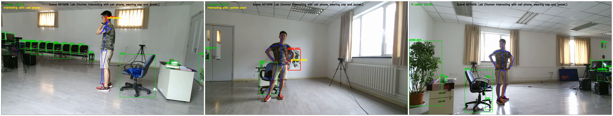
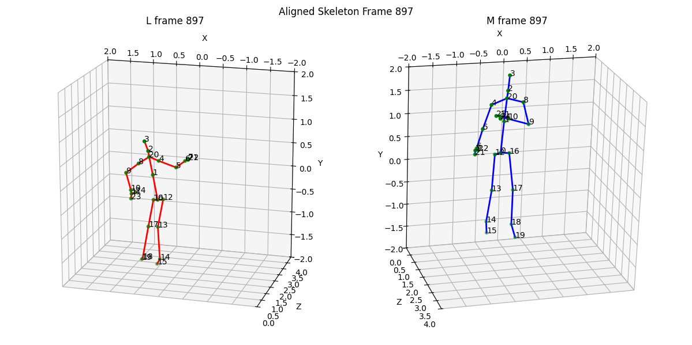

# Human–Object–Scene Interaction

This repository provides a complete and easy to use pipeline for analyzing and visualize Human-Object–Scene interactions using the [PKU-MMD dataset](https://struct002.github.io/PKUMMD/). In this work only**RGB videos**, **skeleton data**, and **label files** are used.  The **depth** and **infrared** data are not included or required for this pipeline. It automatically aligns skeletons, detects objects, projects 3D poses to RGB frames, and generates final interaction videos for each camera view (L, M, R).





## Setup Structure
The config/settings.yaml contains central configurations. The scripts folder contains all scripts including main.py. This executes:
1. skeleton.py	# Aligns skeletons
2. objects.py	# Runs YOLO detection
3. rgb_overlay.py	# Draws skeletons on videos
4. hoi.py		# Creates interaction overlays
5. project_utils.py	# Contains all helper functions

All outputs are saved automatically under /outputs. The data folder contains the PKU-MMD dataset of case “A01N09”.

## Setup Instructions

### 1. Install Required Packages
Run the following command in your terminal or virtual environment:

```bash
pip install numpy opencv-python matplotlib pyyaml ultralytics torch
```
This installs all required dependencies.

### 2. Edit Configuration
Open [`config/settings.yaml`](config/settings.yaml) to set dataset paths and case name, "A01N09", To process another case simply change the value and tune the camera principal and focal length points according to the case you want to visualize.

```yaml
case: "A01N09"
```

### 3. Run the Pipeline

Execute the main script:

```bash
python scripts/main.py
```

## Data Notes

The **`data/`** folder contains the PKU-MMD dataset for the example case **A01N09**.  

To visualize another case:
1. Download the required data from the [PKU-MMD dataset website](https://struct002.github.io/PKUMMD/).  
2. Place the data inside the **`data/`** directory in the same structure.  
3. Update the `case` value in **`config/settings.yaml`**.


## Author Information
**Developed by:** [Muhammad Taha Tariq](https://scholar.google.com/citations?hl=en&pli=1&user=CjFPcqQAAAAJ)  
To visualize and understand **human–object–scene interaction relationships** in multi-view videos.

If you find this project helpful, please consider giving it a star on GitHub and citing it in your research articles.
